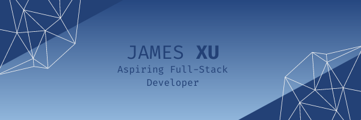

  

<h1 align="center">Hello 👋 I'm James Xu</h1>

 

    
    
    

 

  

&nbsp;

 

<h1 align="center">About Me</h1>
<h3 align="left">An aspiring full-stack developer from Melbourne</h3>

  I am a full-stack bootcamp graduate with a passion for technology and learning. In 2022 I decided to follow a dream of mine to succeed in the tech industry and enrolled with Coder Academy. Follow my journey!

 

  🔭 I’m currently working on TravelBuddy! A travel companion app utilising the power of Google Map API  
  🌱 I’m currently learning in a CoderAcademy Full-Stack Bootcamp  
  📫 How to reach me: 96jamesxu@gmail.com  

<h3 align="left">Tools/Frameworks I Use</h3>

  
  
  
  
  
  
  
  
  

 

<h3 align="left">Languages I Use</h3>

  
  
  
  
  

 

<h3 align="left">Currently Learning</h3>

  
  

 

<!--
**jamesxu1996/jamesxu1996** is a ✨ _special_ ✨ repository because its `README.md` (this file) appears on your GitHub profile.

Here are some ideas to get you started:

- 🔭 I’m currently working on ...
- 🌱 I’m currently learning ...
- 👯 I’m looking to collaborate on ...
- 🤔 I’m looking for help with ...
- 💬 Ask me about ...
- 📫 How to reach me: ...
- 😄 Pronouns: ...
- ⚡ Fun fact: ...
-->
